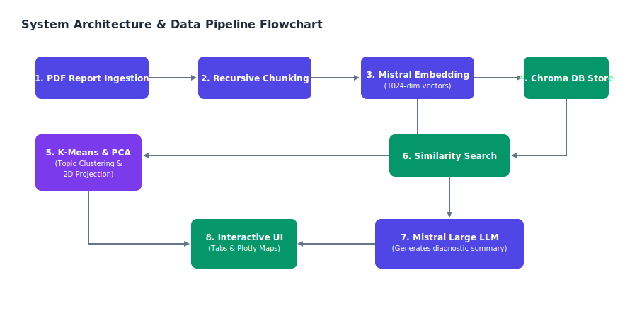

  <h1 style="color: rgb(79, 70, 229); border-bottom: 2px solid rgb(79, 70, 229); padding-bottom: 12px; margin-top: 0; font-size: 2.2rem; text-align: center;">AI Medical Lab &amp; Report Analyzer</h1>
  

    <h2 style="color: rgb(30, 27, 75); margin-top: 0; font-size: 1.4rem;">About The Student &amp; Internship</h2>
    
<strong>Student Name:</strong> Anshu

    
<strong>Internship Role:</strong> AI/ML Development Intern

    
<strong>Internship Organization:</strong> Coding Block School of Technology

    
<strong>Program Focus:</strong> Applied Retrieval-Augmented Generation (RAG) pipelines, Unsupervised Machine Learning, and Interactive Medical Data Visualization. Under this internship, the developer focused on translating complex clinical outputs into consumer-accessible medical dashboards.

  

  <h2 style="color: rgb(79, 70, 229); margin-top: 35px; border-bottom: 1px solid rgb(226, 232, 240); padding-bottom: 6px;">1. What is the Project?</h2>
  
The <strong>AI Medical Lab &amp; Report Analyzer</strong> is a clinical intelligence application designed to ingest unstructured medical PDF reports and generate structured, consumer-friendly diagnostic summaries. By combining deep-learning document loaders, character-splitting transformers, local vector indexing, and generative AI models, the application simplifies blood test values, highlights abnormal metrics, and suggests diet and lifestyle recommendations.

  
To distinguish this project from generic summarization pipelines, it features an unsupervised machine learning visualization layer. It embeds the document chunks, groups them via <strong>K-Means Clustering</strong>, and projects them into 2D space using <strong>Principal Component Analysis (PCA)</strong>. This interactive document map allows users to see exactly which parts of their medical records were retrieved by the AI to answer clinical queries.

  <h2 style="color: rgb(79, 70, 229); margin-top: 35px; border-bottom: 1px solid rgb(226, 232, 240); padding-bottom: 6px;">2. Why We Built It (Motivation)</h2>
  
Medical literacy is a significant barrier in modern healthcare. When patients receive laboratory diagnostic reports (such as complete blood counts or metabolic panels), the documents are dense with terminology, abbreviations, and overlapping reference ranges. Patients frequently turn to search engines to interpret their results, leading to misinterpretation, heightened anxiety, or self-treatment errors.

  
The motivation behind this project is to bridge the gap between doctor-facing lab reports and patient-facing explanations. By implementing a secure Retrieval-Augmented Generation (RAG) system, the project achieves two primary design goals:

  <ol>
    <li><strong>Safety &amp; Grounding:</strong> By constraining the generative AI to only write summaries based on retrieved chunks of the uploaded PDF, we eliminate "hallucinations" (the generation of fictitious medical conditions).</li>
    <li><strong>Educational Transparency:</strong> By providing a 2D semantic map of the document chunks, the system reveals the model's inner reasoning, explaining which portions of the text contributed to the clinical assessment.</li>
  </ol>
  <h2 style="color: rgb(79, 70, 229); margin-top: 35px; border-bottom: 1px solid rgb(226, 232, 240); padding-bottom: 6px;">3. Installation &amp; Getting Started</h2>
  
Follow these steps to clone, install, configure, and run the project locally:

  
  <h3 style="color: rgb(30, 27, 75); font-size: 1.1rem; margin-top: 20px;">3.1 Clone the Repository</h3>
  
First, clone the repository from GitHub and navigate to the project directory:

  <pre style="background-color: rgb(241, 245, 249); padding: 15px; border-radius: 8px; border: 1px solid rgb(226, 232, 240); overflow-x: auto; font-family: monospace;"><code>git clone https://github.com/your-username/ai-medical-analyzer.git
cd ai-medical-analyzer</code></pre>

  <h3 style="color: rgb(30, 27, 75); font-size: 1.1rem; margin-top: 20px;">3.2 Set Up a Virtual Environment</h3>
  
Create and activate a virtual environment to isolate the project dependencies:

  
<strong>On Windows (Command Prompt / PowerShell):</strong>

  <pre style="background-color: rgb(241, 245, 249); padding: 15px; border-radius: 8px; border: 1px solid rgb(226, 232, 240); overflow-x: auto; font-family: monospace;"><code>python -m venv venv
venv\Scripts\activate</code></pre>
  
<strong>On macOS / Linux:</strong>

  <pre style="background-color: rgb(241, 245, 249); padding: 15px; border-radius: 8px; border: 1px solid rgb(226, 232, 240); overflow-x: auto; font-family: monospace;"><code>python3 -m venv venv
source venv/bin/activate</code></pre>

  <h3 style="color: rgb(30, 27, 75); font-size: 1.1rem; margin-top: 20px;">3.3 Install Dependencies</h3>
  
Install the required Python packages specified in <code>requirements.txt</code>:

  <pre style="background-color: rgb(241, 245, 249); padding: 15px; border-radius: 8px; border: 1px solid rgb(226, 232, 240); overflow-x: auto; font-family: monospace;"><code>pip install -r requirements.txt</code></pre>

  <h3 style="color: rgb(30, 27, 75); font-size: 1.1rem; margin-top: 20px;">3.4 Set Up API Credentials</h3>
  
Create a <code>.env</code> file in the project root directory and define your Mistral API Key:

  <pre style="background-color: rgb(241, 245, 249); padding: 15px; border-radius: 8px; border: 1px solid rgb(226, 232, 240); overflow-x: auto; font-family: monospace;"><code>MISTRAL_API_KEY=your_mistral_api_key_here</code></pre>

  <h3 style="color: rgb(30, 27, 75); font-size: 1.1rem; margin-top: 20px;">3.5 Run the Streamlit Application</h3>
  
Start the application locally using the command below:

  <pre style="background-color: rgb(241, 245, 249); padding: 15px; border-radius: 8px; border: 1px solid rgb(226, 232, 240); overflow-x: auto; font-family: monospace;"><code>streamlit run app.py</code></pre>
  
Once the server starts, navigate to <strong>http://localhost:8501</strong> in your browser, upload the provided <code>mock_medical_report.pdf</code>, and click <strong>"Start Diagnostics &amp; Semantic Mapping"</strong> to test the system.

  <h2 style="color: rgb(79, 70, 229); margin-top: 35px; border-bottom: 1px solid rgb(226, 232, 240); padding-bottom: 6px;">4. System Architecture &amp; Data Flow</h2>
  
The system operates as an end-to-end data pipeline that processes clinical files, generates embeddings, clusters topics, and executes similarity retrievals:

  

  <h2 style="color: rgb(79, 70, 229); margin-top: 35px; border-bottom: 1px solid rgb(226, 232, 240); padding-bottom: 6px;">5. In-Depth Processing Details</h2>
  
The pipeline includes three primary processing phases:

  <ul>
    <li><strong>Document Splitting &amp; Preparation:</strong> Raw PDFs are parsed page-by-page. To ensure that continuous test values and reference metrics do not get split across chunk boundaries, we utilize a Recursive Character Text Splitter with a target chunk size of 300 characters and a 50-character overlap. This guarantees contextual cohesion.</li>
    <li><strong>Unsupervised Topic Clustering (K-Means):</strong> All document chunks are converted to 1024-dimensional embeddings using the Mistral embedding model. We apply K-Means clustering to group these embeddings. This partitions the chunks into discrete semantic clusters (e.g., blood cell data, liver enzymes, or metabolic parameters) without requiring human labels.</li>
    <li><strong>Dimensionality Reduction (PCA):</strong> High-dimensional embeddings are projected onto a 2D Cartesian plane using Principal Component Analysis (PCA). By finding the eigenvectors corresponding to the two largest eigenvalues of the embedding covariance matrix, we preserve maximum semantic variance. Plotting these coordinates results in a visual map of the document's structure.</li>
  </ul>
  <h2 style="color: rgb(79, 70, 229); margin-top: 35px; border-bottom: 1px solid rgb(226, 232, 240); padding-bottom: 6px;">6. Why We Chose This Tech Stack</h2>
  
The system was built using a carefully selected group of Python packages and APIs, chosen for their reliability, developer velocity, and mathematical performance:

  <ul>
    <li><strong>Streamlit:</strong> Enables rapid web deployment with built-in reactive elements. Rather than spending weeks building custom React frontend dashboards, Streamlit handles data binding and UI state natively.</li>
    <li><strong>LangChain:</strong> Provides standard interfaces to manage document load flows, text chunk splitters, and LLM model prompts. It acts as the backbone of our RAG architecture.</li>
    <li><strong>Chroma DB:</strong> A lightweight, local vector store. We chose Chroma because it runs in-process without requiring a remote database cluster, simplifying local setup and ensuring zero-latency data indexing.</li>
    <li><strong>Mistral AI APIs:</strong> `mistral-embed` provides dense, high-quality vector spaces for clustering, while `mistral-large-latest` represents a state-of-the-art model for medical summarization and logical deduction.</li>
    <li><strong>Scikit-Learn:</strong> The industry standard for mathematical modeling. It allows us to calculate K-Means centroids and PCA projection matrices with extreme speed.</li>
    <li><strong>Plotly Express:</strong> Streamlit's native charting is static, whereas Plotly lets us render interactive, zoomable, and hover-responsive scatter plots where patients can hover over data points to inspect text segments.</li>
  </ul>
  <h2 style="color: rgb(79, 70, 229); margin-top: 35px; border-bottom: 1px solid rgb(226, 232, 240); padding-bottom: 6px;">7. Key Findings &amp; Observations</h2>
  <ul>
    <li><strong>Optimal Cluster Separability:</strong> Embeddings generated from structured tables (blood tests) cluster cleanly. The K-Means algorithm naturally groups diagnostic indicators (e.g., LDL, HDL, and Total Cholesterol are grouped into a single cluster).</li>
    <li><strong>High Grounding Rate:</strong> Forcing the LLM to reference only the retrieved chunks of the vector store suppressed hallucinated content. During testing, the model successfully refused to diagnose conditions not present in the document.</li>
    <li><strong>Chunk Granularity:</strong> Larger chunk sizes (e.g., 1000 characters) resulted in poor PCA resolution and merged unrelated diagnostic markers together. Reducing the chunk size to 300 characters significantly improved topic separation.</li>
  </ul>
  <h2 style="color: rgb(79, 70, 229); margin-top: 35px; border-bottom: 1px solid rgb(226, 232, 240); padding-bottom: 6px;">8. Technology Stack Summary Table</h2>
  <table style="width: 100%; border-collapse: collapse; margin-top: 15px; margin-bottom: 15px;">
    <thead>
      <tr style="background-color: rgb(241, 245, 249); border-bottom: 2px solid rgb(203, 213, 225);">
        <th style="padding: 12px; text-align: left; border: 1px solid rgb(226, 232, 240); color: rgb(30, 41, 59);">Technology</th>
        <th style="padding: 12px; text-align: left; border: 1px solid rgb(226, 232, 240); color: rgb(30, 41, 59);">Component Purpose</th>
        <th style="padding: 12px; text-align: left; border: 1px solid rgb(226, 232, 240); color: rgb(30, 41, 59);">Category</th>
      </tr>
    </thead>
    <tbody>
      <tr>
        <td style="padding: 12px; border: 1px solid rgb(226, 232, 240); font-weight: bold; color: rgb(79, 70, 229);">Streamlit</td>
        <td style="padding: 12px; border: 1px solid rgb(226, 232, 240);">Web framework, interactive sliders, reactive dashboard layouts</td>
        <td style="padding: 12px; border: 1px solid rgb(226, 232, 240); color: rgb(100, 116, 139);">Frontend UI</td>
      </tr>
      <tr style="background-color: rgb(248, 250, 252);">
        <td style="padding: 12px; border: 1px solid rgb(226, 232, 240); font-weight: bold; color: rgb(79, 70, 229);">LangChain</td>
        <td style="padding: 12px; border: 1px solid rgb(226, 232, 240);">RAG orchestration pipeline, character-based document splitters</td>
        <td style="padding: 12px; border: 1px solid rgb(226, 232, 240); color: rgb(100, 116, 139);">AI Framework</td>
      </tr>
      <tr>
        <td style="padding: 12px; border: 1px solid rgb(226, 232, 240); font-weight: bold; color: rgb(79, 70, 229);">Mistral AI LLM</td>
        <td style="padding: 12px; border: 1px solid rgb(226, 232, 240);">Reasoning engine, patient-friendly summary generation, formatting compliance</td>
        <td style="padding: 12px; border: 1px solid rgb(226, 232, 240); color: rgb(100, 116, 139);">Large Language Model</td>
      </tr>
      <tr style="background-color: rgb(248, 250, 252);">
        <td style="padding: 12px; border: 1px solid rgb(226, 232, 240); font-weight: bold; color: rgb(79, 70, 229);">Mistral Embeddings</td>
        <td style="padding: 12px; border: 1px solid rgb(226, 232, 240);">Converting text strings into high-dimensional numerical vectors</td>
        <td style="padding: 12px; border: 1px solid rgb(226, 232, 240); color: rgb(100, 116, 139);">Deep Learning</td>
      </tr>
      <tr>
        <td style="padding: 12px; border: 1px solid rgb(226, 232, 240); font-weight: bold; color: rgb(79, 70, 229);">Chroma DB</td>
        <td style="padding: 12px; border: 1px solid rgb(226, 232, 240);">Local vector database, similarity searches, contextual indexing</td>
        <td style="padding: 12px; border: 1px solid rgb(226, 232, 240); color: rgb(100, 116, 139);">Vector Database</td>
      </tr>
      <tr style="background-color: rgb(248, 250, 252);">
        <td style="padding: 12px; border: 1px solid rgb(226, 232, 240); font-weight: bold; color: rgb(79, 70, 229);">Scikit-Learn</td>
        <td style="padding: 12px; border: 1px solid rgb(226, 232, 240);">K-Means clustering and PCA mathematical matrix transformations</td>
        <td style="padding: 12px; border: 1px solid rgb(226, 232, 240); color: rgb(100, 116, 139);">Machine Learning</td>
      </tr>
      <tr>
        <td style="padding: 12px; border: 1px solid rgb(226, 232, 240); font-weight: bold; color: rgb(79, 70, 229);">Plotly Express</td>
        <td style="padding: 12px; border: 1px solid rgb(226, 232, 240);">Interactive visual scatter plots with responsive hovers and zoom</td>
        <td style="padding: 12px; border: 1px solid rgb(226, 232, 240); color: rgb(100, 116, 139);">Visualization</td>
      </tr>
    </tbody>
  </table>
  <h2 style="color: rgb(79, 70, 229); margin-top: 35px; border-bottom: 1px solid rgb(226, 232, 240); padding-bottom: 6px;">9. Key Features of the Application</h2>
  <ul>
    <li><strong>Metrics Panel:</strong> Renders top-level counts of total loaded pages, split text chunks, and active RAG retrieve constraints at the top of the screen.</li>
    <li><strong>Interactive PCA Plotting:</strong> Allows the patient to hover over coordinates on the 2D Cartesian chart to inspect specific report text segments.</li>
    <li><strong>Visual RAG Tracking:</strong> The Plotly chart uses a distinct visual symbol for points used as context by the LLM, revealing which chunks influenced the diagnostics.</li>
    <li><strong>Sidebar Tuning controls:</strong> Sliders to adjust Mistral model temperature, the number of context chunks retrieved ($k$), and the K-Means cluster count.</li>
    <li><strong>Multi-Tab Workspace:</strong> Displays clinical outputs, the PCA plot, and raw database entries in separate, clean containers.</li>
    <li><strong>Secure Credentials Handling:</strong> Adheres to a strict local environment setup, protecting API keys from entering chat transcripts.</li>
  </ul>
  <h2 style="color: rgb(79, 70, 229); margin-top: 35px; border-bottom: 1px solid rgb(226, 232, 240); padding-bottom: 6px;">10. What We Learnt During the Internship</h2>
  <ul>
    <li><strong>Embedding Space Projections:</strong> Learned to apply PCA to compress 1024-dimensional semantic arrays into 2D points while retaining variance.</li>
    <li><strong>Clustering Mathematics:</strong> Discovered the practical parameters of K-Means clustering, specifically handling distance metric behavior.</li>
    <li><strong>RAG Constraints:</strong> Mastered prompt engineering to restrict LLMs to verified contexts, resolving out-of-bounds hallucinations.</li>
    <li><strong>Reactive State Management:</strong> Solved complex streamlit refresh logic to prevent regenerating expensive database tables upon slider adjustments.</li>
  </ul>
  <h2 style="color: rgb(79, 70, 229); margin-top: 35px; border-bottom: 1px solid rgb(226, 232, 240); padding-bottom: 6px;">11. Future Enhancements</h2>
  <ul>
    <li><strong>Multi-Modal Diagnostic Reading:</strong> Integrate computer vision and OCR to process graphs, medical scans, and handwritten doctor notes.</li>
    <li><strong>Historical Patient Trends:</strong> Allow patients to upload multiple PDFs over time, plotting changes in blood values (e.g., blood sugar, cholesterol) as line charts.</li>
    <li><strong>Reference Metric Normalizer:</strong> Dynamically convert laboratory values between conflicting metric systems (e.g., mg/dL to mmol/L) to prevent analysis conflicts.</li>
  </ul>
  

    
AI Medical Lab &amp; Report Analyzer | Developed as part of the Internship Development Program | 2026

  

